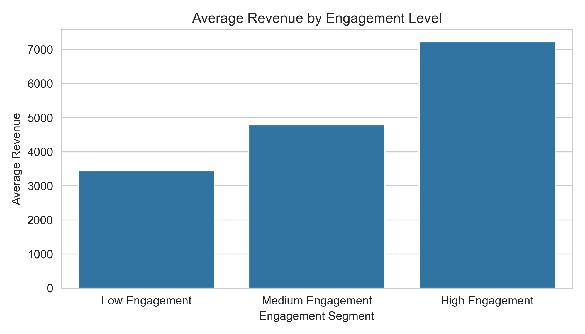
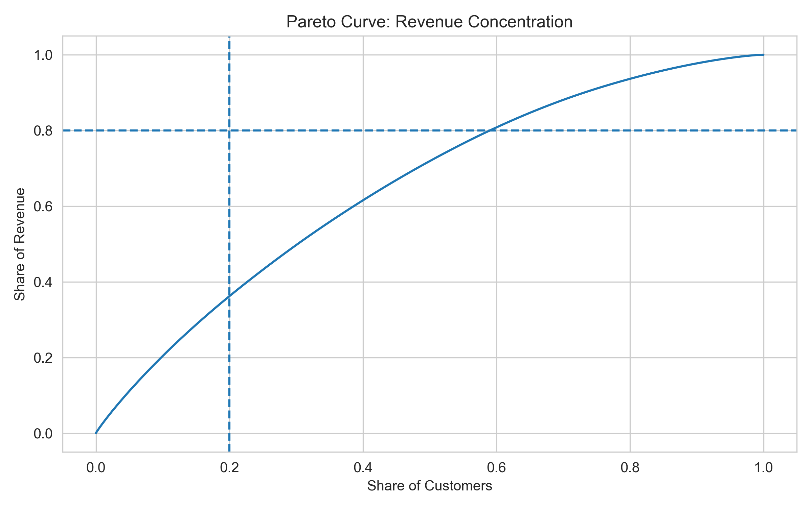
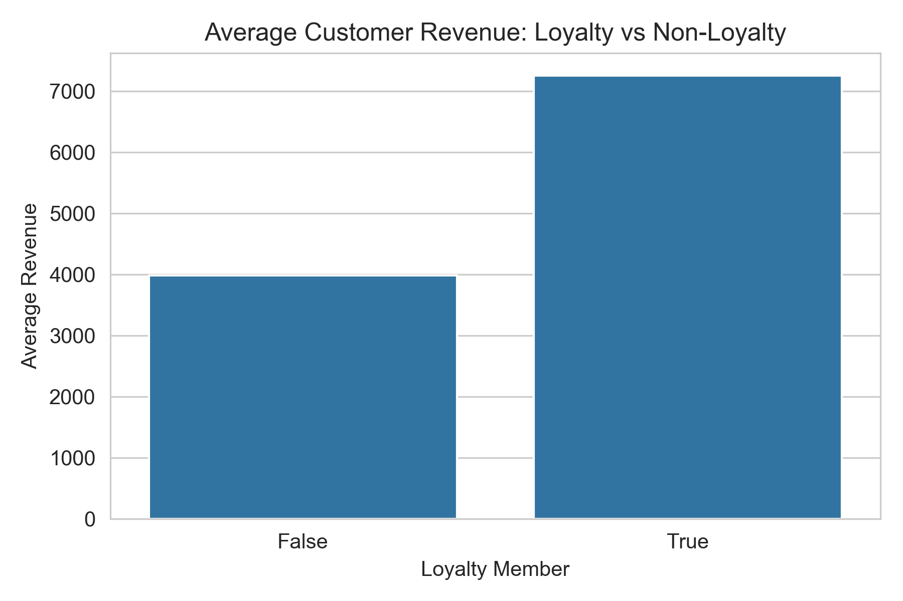
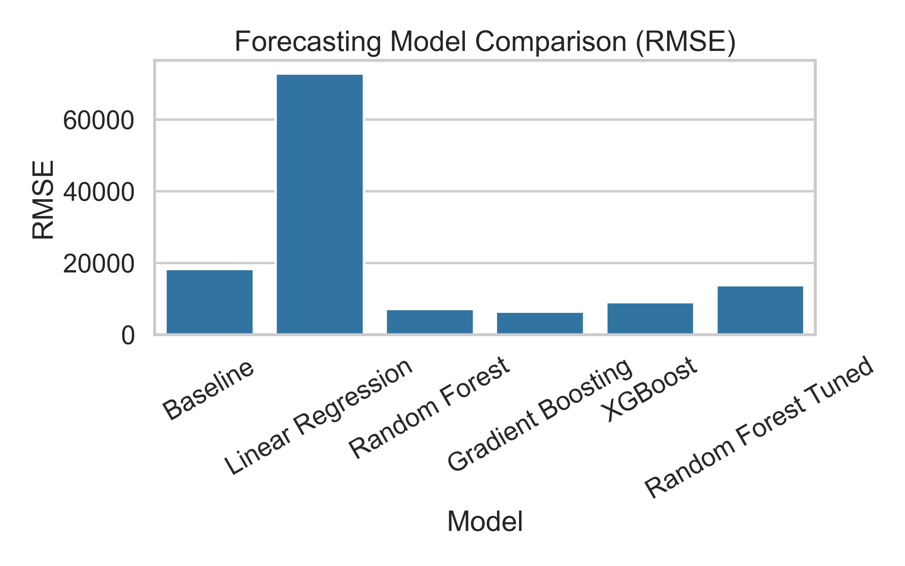
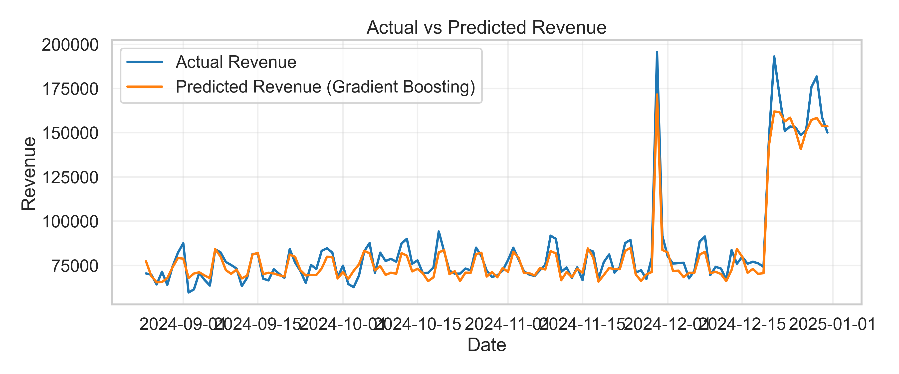
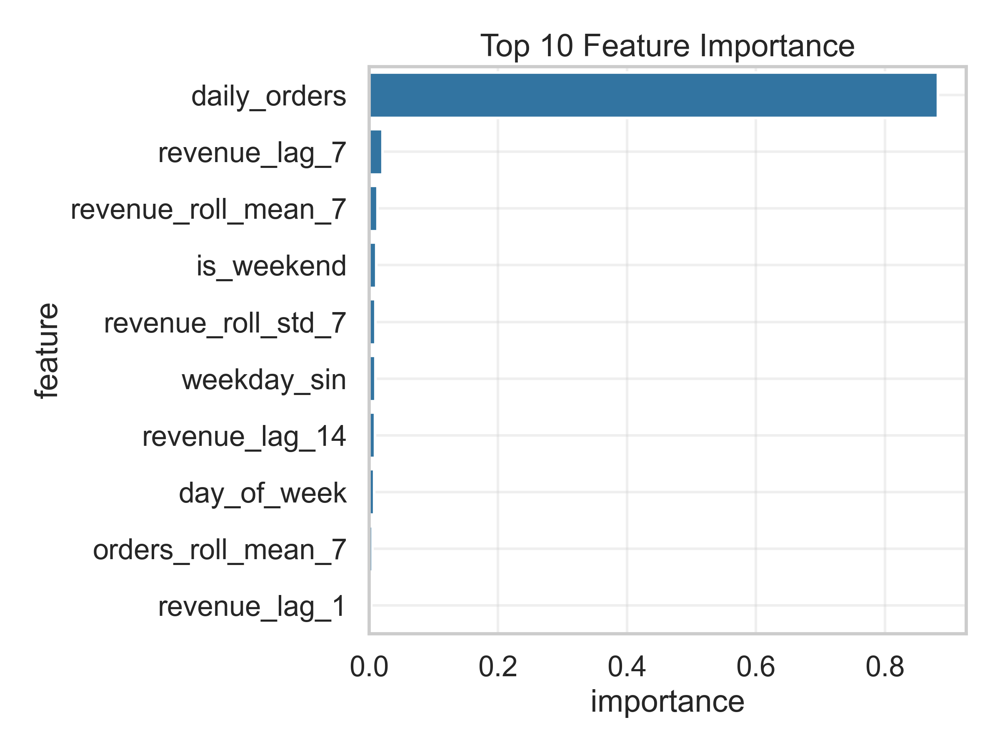
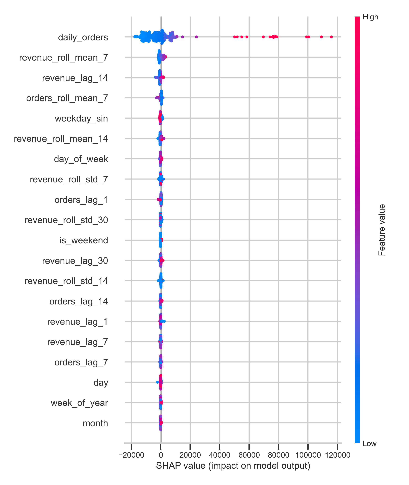

# E-commerce Customer Analytics and Sales Forecasting

This is an end-to-end Data Science project where I simulate a realistic analytics pipeline for an e-commerce platform.

In this project I demonstrate how machine learning and data analysis can be applied to:

- understand customer purchasing behavior  
- segment customers for targeted marketing  
- forecast future revenue  
- interpret machine learning models  

The goal of this project is to replicate the workflow commonly used in real-world data science environments.

---

# Project Overview

E-commerce companies generate large volumes of behavioral and transactional data.  
By analyzing this data, I can better understand customer behavior and predict future demand.

In this project I built a complete machine learning pipeline focused on two main areas.

### Customer Analytics

I analyze customer behavior to:

- identify customer segments  
- understand purchasing patterns  
- support targeted marketing strategies  

### Sales Forecasting

I also develop forecasting models to:

- predict future revenue  
- identify demand trends  
- support operational planning  

---

# Visual Overview

Below are some of the key visualizations generated during the analysis.

---

## Revenue Distribution

This visualization shows how revenue is distributed across different customer engagement segments.

---

## Revenue Contribution (Pareto Analysis)

I used a Pareto analysis to understand how revenue is concentrated across customers.

The Pareto curve highlights that a relatively small portion of customers contributes a large share of total revenue.

---

## Loyalty vs Non-Loyalty Customers

This visualization compares revenue generated by loyalty program members versus non-members.

The analysis shows that loyalty program members typically generate higher revenue.

---

## Forecasting Model Performance

I evaluated multiple machine learning models to predict daily revenue.

Tree-based ensemble models significantly outperform simple baseline forecasts.

---

## Forecast vs Actual Revenue

The best-performing model successfully captures both long-term revenue trends and short-term fluctuations.

---

## Feature Importance

I analyzed feature importance to understand the key drivers of revenue predictions.

Key drivers include:

- daily order volume  
- recent revenue trends  
- rolling averages  
- temporal features  

---

## Model Explainability

To better understand the forecasting model, I applied SHAP explainability techniques.

SHAP values allow me to interpret how individual variables influence model predictions.

---

# Dataset

Because real-world e-commerce datasets are usually proprietary, I generated a **synthetic dataset** designed to mimic realistic online retail behavior.

The dataset includes several categories of variables.

### Customer Attributes

- customer_id  
- age  
- income  
- country  
- loyalty membership  
- signup date  

### Behavioral Variables

- total orders  
- total spent  
- average order value  
- days since last purchase  
- website visits  
- app usage  
- discount usage  

### Transaction Variables

- order date  
- order value  
- product category  
- promotion flag  
- marketing campaigns  

### Temporal Features

- day of week  
- month  
- seasonal indicators  
- rolling statistics  
- lag variables  

The synthetic dataset incorporates realistic dynamics such as:

- seasonal demand patterns  
- promotional campaigns  
- gradual platform growth  
- random purchasing variability  

---

# Project Workflow

I structured the project into several notebooks representing each stage of the data science pipeline.

---

## 1 Dataset Generation

First, I generated a synthetic e-commerce dataset to simulate realistic customer behavior and transactional activity.

The dataset includes:

- seasonal demand patterns  
- promotional effects  
- variability in customer behavior  
- long-term platform growth  

---

## 2 Exploratory Data Analysis

I performed exploratory data analysis to investigate patterns and relationships in the dataset.

Key analyses include:

- revenue trends over time  
- purchasing seasonality  
- correlations between behavioral variables  
- distribution of customer metrics  

---

## 3 Feature Engineering

Next, I created additional predictive features to improve model performance.

Examples include:

- lag features  
- rolling averages  
- rolling volatility  
- RFM-style metrics  
- temporal encodings  

These features capture both short-term and long-term purchasing behavior patterns.

---

## 4 Customer Segmentation

I applied clustering techniques to identify groups of customers with similar purchasing behavior.

The algorithms evaluated include:

- K-Means  
- Hierarchical Clustering  
- DBSCAN  

Customer segmentation can support:

- targeted marketing campaigns  
- loyalty programs  
- personalized promotions  

---

## 5 Sales Forecasting

I trained several machine learning models to forecast daily revenue.

The models evaluated include:

- Linear Regression  
- Random Forest  
- Gradient Boosting  
- XGBoost  

Evaluation metrics include:

- MAE  
- RMSE  
- R²  
- MAPE  

I also performed residual diagnostics and forecast visualizations to validate model performance.

---

## 6 Model Explainability

To better understand the forecasting model, I applied SHAP explainability techniques.

The analysis includes:

- global feature importance  
- SHAP summary plots  
- feature dependence analysis  
- local prediction explanations  

Explainability helps reveal how the forecasting model generates predictions.

---

# Key Insights

Several important insights emerged from the analysis.

### Revenue Drivers

Revenue predictions are strongly influenced by:

- order volume  
- recent purchasing activity  
- rolling revenue statistics  
- temporal purchasing patterns  

### Forecasting Performance

Ensemble machine learning models significantly outperform simple baseline forecasts.

Among the models tested, **Gradient Boosting achieved the best predictive performance**.

### Customer Behavior

Customer segmentation reveals distinct purchasing patterns that can inform marketing strategies.

---

# Business Applications

The insights generated in this project can support several real-world business decisions.

### Inventory Planning

Demand forecasts help reduce stockouts and excess inventory.

### Marketing Strategy

Customer segmentation enables targeted promotional campaigns.

### Operational Planning

Revenue forecasts support logistics and staffing decisions.

### Financial Planning

Sales forecasts help improve budgeting and revenue projections.

---

# Technologies Used

Python ecosystem.

Main libraries used in this project include:

- pandas  
- numpy  
- scikit-learn  
- xgboost  
- shap  
- matplotlib  
- seaborn  
- statsmodels  

---

# Future Improvements

Potential extensions of this project include:

- product-level demand forecasting  
- real-time forecasting dashboards  
- automated model retraining pipelines  
- deployment of forecasting models as an API  

---

# Author

Emerson Antonio da Silva  

Data Science Portfolio Project

E-commerce Customer Analytics and Sales Forecasting