# 🫀 CardioRisk ML — Cardiovascular Risk Prediction


---

## 📋 Project Overview

A full end-to-end machine learning pipeline for **binary classification of cardiovascular risk** in adult patients, built around a synthetic clinical dataset of **10,000 records** calibrated against the Framingham Heart Study and NHANES population distributions.

The project answers three clinical questions:

1. Which factors most drive cardiovascular risk?
2. Can a machine learning model reliably identify at-risk patients preventively?
3. What probability threshold maximises clinical utility in a screening context?

---

## 📁 Repository Structure

```
CardioRisk_ML/
│
├── notebooks/
│   ├── 01_data_generation.ipynb       # Synthetic dataset generation
│   ├── 02_exploratory_data_analysis.ipynb  # EDA & clinical insights
│   ├── 03_preprocessing.ipynb         # Encoding, feature engineering, SMOTE
│   ├── 04_modelling.ipynb             # Model training & comparison
│   └── 05_storytelling.ipynb          # Results, conclusions & recommendations
│
├── data/
│   ├── raw/                           # Generated dataset (cardiovascular_patients.csv)
│   ├── processed/                     # Train/test sets after preprocessing
│   └── eda_charts/                    # All generated visualisations
│
└── README.md
```


---

## 🎞️ Presentation Preview

> 📁 `figures/presentation/` — 10-slide summary deck exported from the full PPTX

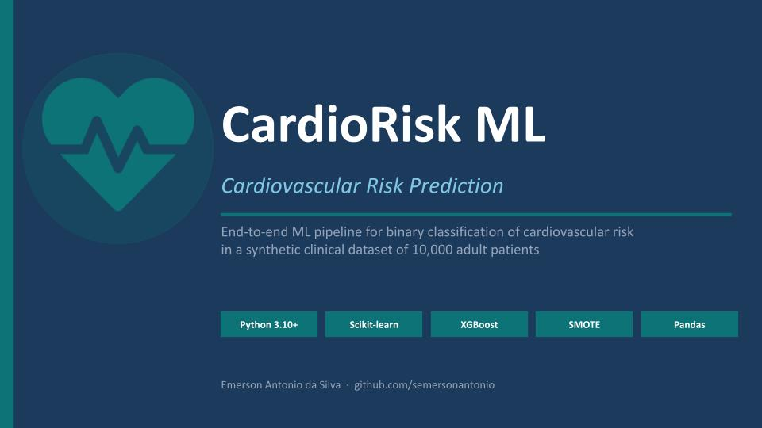
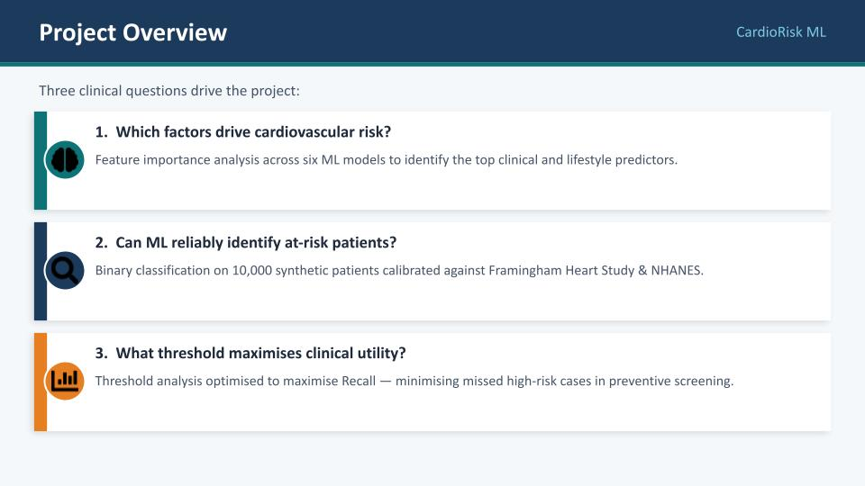
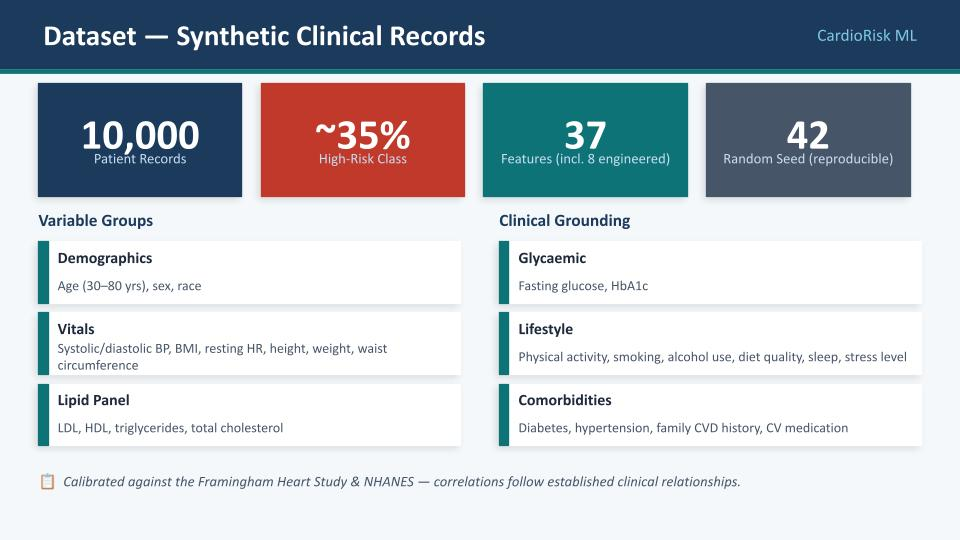
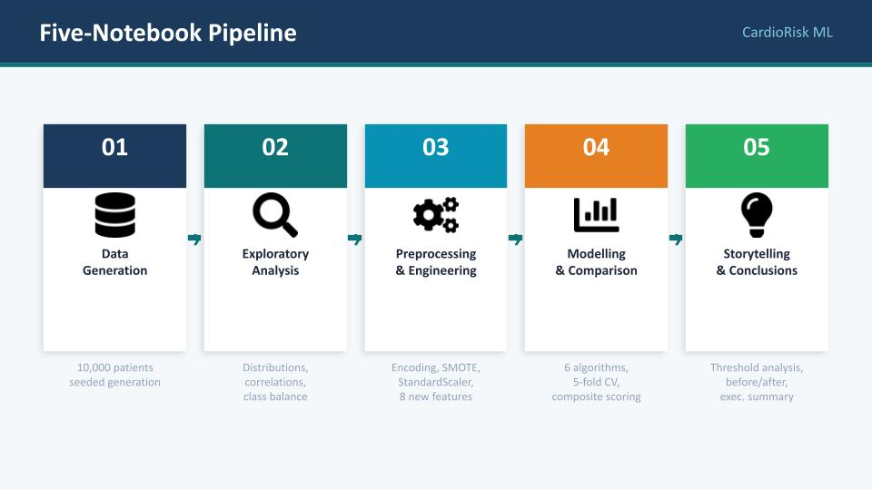
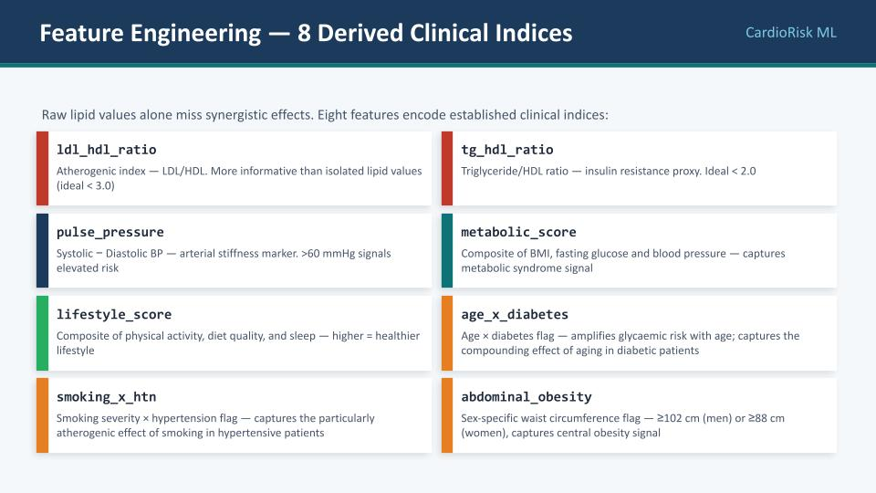
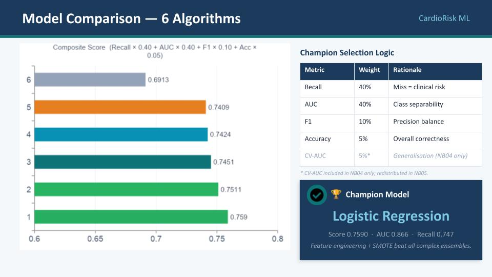
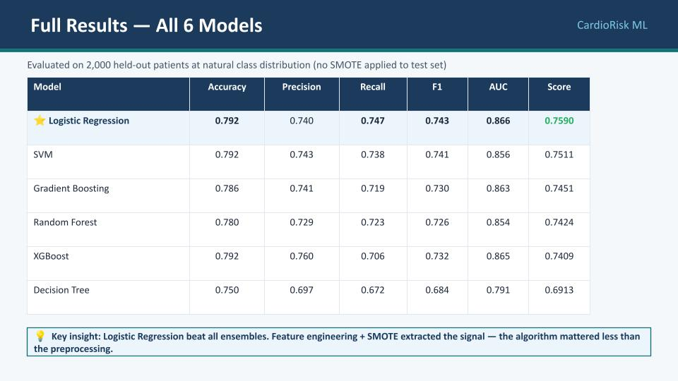
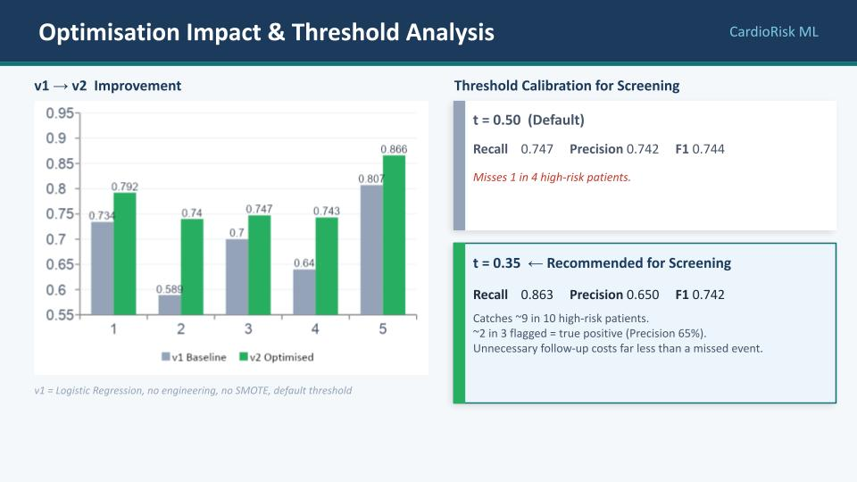
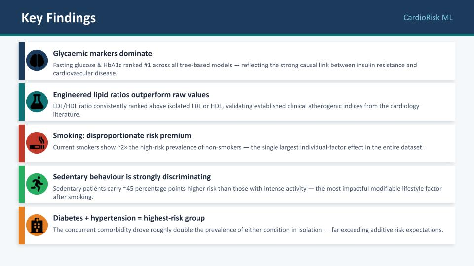
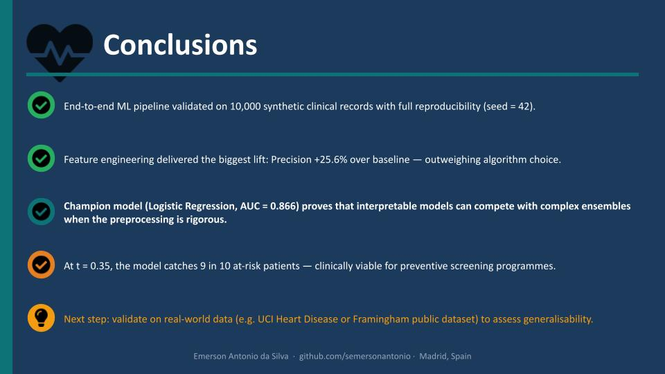

---

## 🔬 Dataset

| Attribute | Value |
|---|---|
| Records | 10,000 patients |
| Target | `cardiovascular_risk` (binary: 0 = Low, 1 = High) |
| Class balance | ~35% high-risk (before SMOTE) |
| Variables | Demographics, vitals, lipid panel, glycaemic markers, lifestyle |
| Source | Synthetic — calibrated vs. Framingham Heart Study & NHANES |
| Seed | 42 (fully reproducible) |

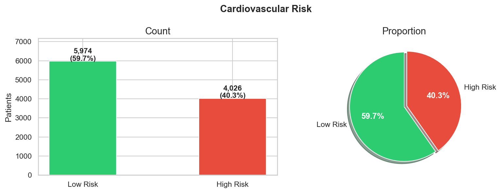

Clinical correlations mirror established medical literature: blood pressure rises with age and BMI, HDL is naturally higher in women, and the cardiovascular risk score is derived from the Framingham Risk Equation.

---

## ⚙️ Pipeline

### 1 · Data Generation
Synthetic patient records generated using `numpy` with medically validated distributions. Age is sampled from a truncated normal (30–80 years), sex and race follow population study proportions, and comorbidities are derived probabilistically from lab values.

### 2 · Exploratory Data Analysis
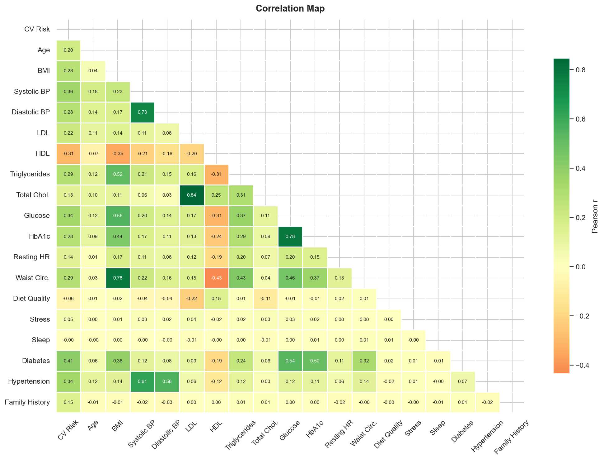
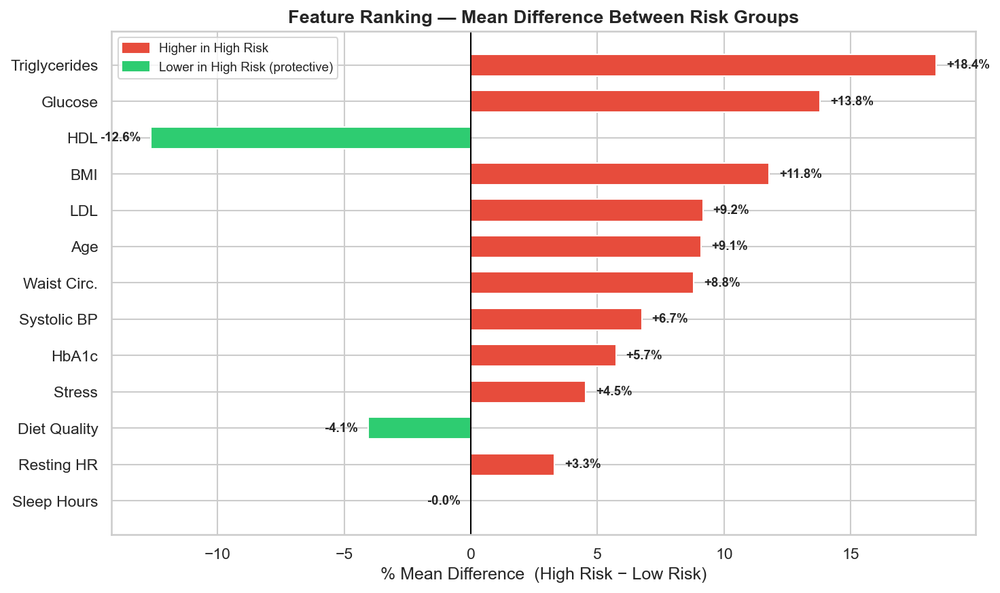

Distribution analysis across risk groups, correlation heatmaps, sex-stratified comparisons, and identification of the typical high-risk patient profile. EDA findings directly informed the feature engineering strategy in Step 3.

### 3 · Preprocessing & Feature Engineering

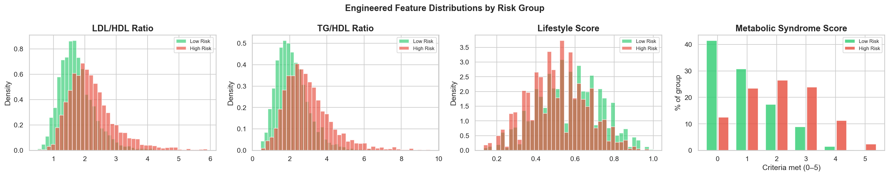
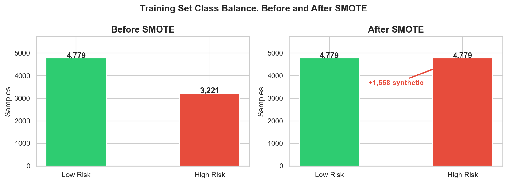

Five-stage pipeline:

| Stage | Detail |
|---|---|
| Categorical encoding | Ordinal for clinically ordered variables; one-hot for nominal |
| Feature engineering | 8 derived clinical indices (see table below) |
| Train/test split | 80/20 stratified split |
| Scaling | `StandardScaler` fitted on training set only (no leakage) |
| Class balancing | SMOTE applied to training set only |

**Engineered features:**

| Feature | Clinical rationale |
|---|---|
| `ldl_hdl_ratio` | Atherogenic index — more informative than isolated lipid values |
| `tg_hdl_ratio` | Insulin resistance proxy (ideal < 2.0) |
| `pulse_pressure` | Arterial stiffness marker (>60 mmHg = elevated risk) |
| `metabolic_score` | Composite of BMI, glucose, blood pressure |
| `lifestyle_score` | Composite of normalised physical activity, diet quality, and sleep (higher = healthier lifestyle) |
| `abdominal_obesity` | Sex-specific waist flag: ≥102 cm (men) or ≥88 cm (women) — central obesity marker |
| `age_x_diabetes` | Age × diabetes flag — compounding glycaemic risk as patients age |
| `smoking_x_htn` | Smoking severity × hypertension — captures the particularly atherogenic co-occurrence |

### 4 · Modelling
Six algorithms trained and evaluated with 5-fold cross-validation:

| Model | Type |
|---|---|
| Logistic Regression | Linear baseline |
| Decision Tree | Fully interpretable reference |
| Random Forest | Low-variance bagging ensemble |
| Gradient Boosting | High-power boosting ensemble |
| XGBoost | State-of-the-art on tabular data |
| SVM | Margin-based classifier |

Champion selected via composite scoring: **Recall × 0.40 + AUC × 0.40 + F1 × 0.10 + Accuracy × 0.05 + CV-AUC × 0.05**. In preventive screening, a missed high-risk patient (false negative) carries a substantially higher cost than an unnecessary follow-up (false positive), hence the emphasis on Recall.

### 5 · Storytelling
Self-contained notebook that re-runs the full pipeline and consolidates all findings into a clinical narrative, including threshold analysis, optimisation impact (v1 → v2), and an executive summary.

---

## 📊 Results

### Model Comparison

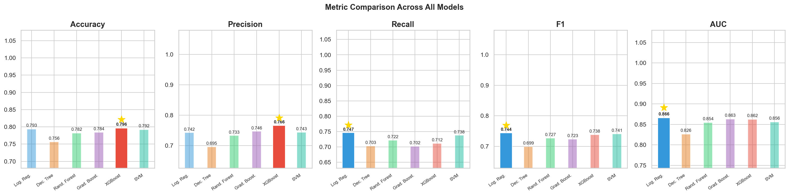
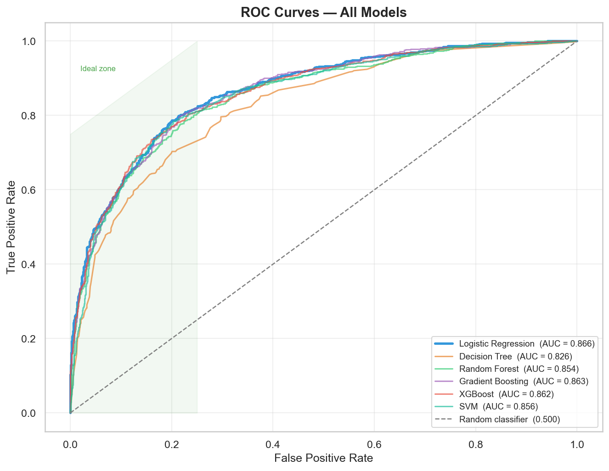
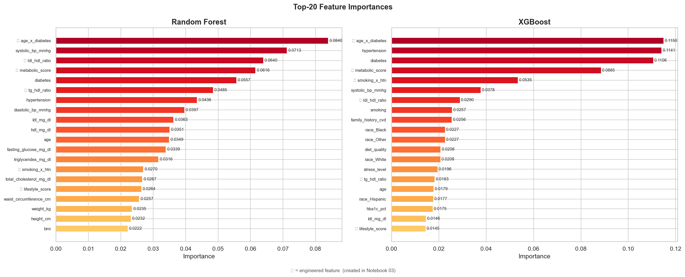
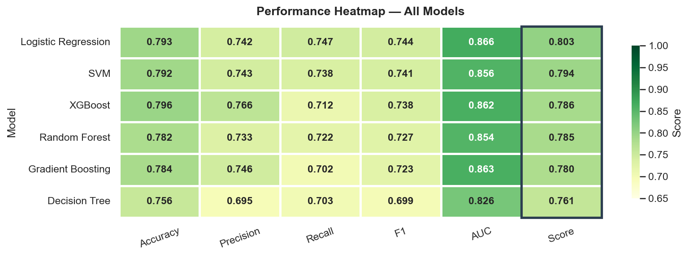

Six models were trained on 9,558 SMOTE-balanced samples and evaluated on 2,000 held-out patients at the natural class distribution. Champion selected by composite score (Recall × 0.40 + AUC × 0.40 + F1 × 0.10 + Accuracy × 0.05).

| Model | Accuracy | Precision | Recall | F1 | AUC | Score |
|---|---|---|---|---|---|---|
| **Logistic Regression ⭐** | **0.792** | **0.740** | **0.747** | **0.743** | **0.866** | **0.7590** |
| SVM | 0.792 | 0.743 | 0.738 | 0.741 | 0.856 | 0.7511 |
| Gradient Boosting | 0.786 | 0.741 | 0.719 | 0.730 | 0.863 | 0.7451 |
| Random Forest | 0.780 | 0.729 | 0.723 | 0.726 | 0.854 | 0.7424 |
| XGBoost | 0.792 | 0.760 | 0.706 | 0.732 | 0.865 | 0.7409 |
| Decision Tree | 0.750 | 0.697 | 0.672 | 0.684 | 0.791 | 0.6913 |

> ⭐ Champion model selected by composite score that prioritises Recall and AUC — the metrics that matter most in a preventive clinical screening context.

### Optimisation Impact (v1 → v2)

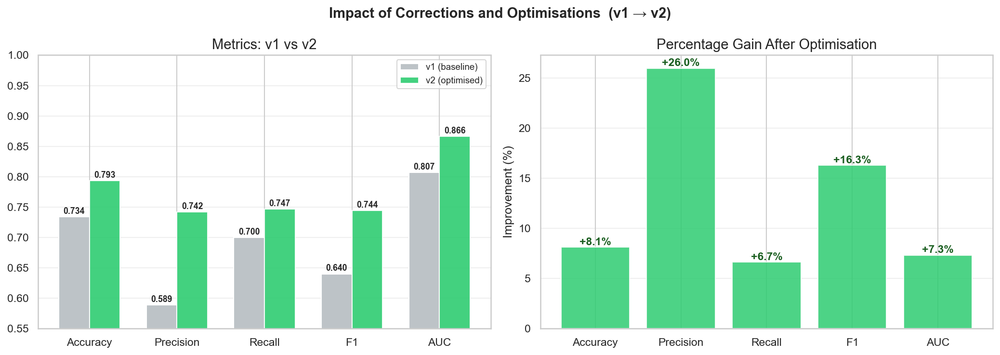

| Metric | v1 Baseline | v2 Optimised | Gain |
|---|---|---|---|
| Accuracy | 0.734 | 0.792 | +7.9% |
| Precision | 0.589 | 0.740 | +25.6% |
| Recall | 0.700 | 0.747 | +6.7% |
| F1 | 0.640 | 0.743 | +16.1% |
| AUC | 0.807 | 0.866 | +7.3% |

> v1 = Logistic Regression with no feature engineering, no SMOTE, default threshold. v2 = same algorithm with full preprocessing pipeline: 8 engineered features + SMOTE + stratified split + StandardScaler.

### Recommended Threshold

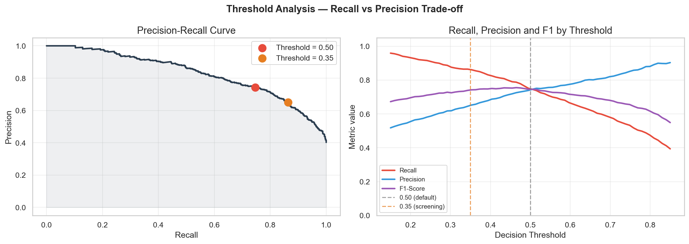

| Threshold | Recall | Precision | F1 |
|---|---|---|---|
| t = 0.50 (default) | 0.747 | 0.742 | 0.744 |
| **t = 0.35 (screening)** | **0.863** | **0.650** | **0.742** |

At **t = 0.35**, the model correctly identifies **~9 out of every 10** high-risk patients. The reduction in precision (~2 in 3 flagged patients is a true positive, Precision 0.650) is clinically acceptable — an unnecessary follow-up exam is far less costly than a missed cardiovascular event. The Precision-Recall curve in Notebook 05 provides a full trade-off analysis across the threshold range 0.15–0.85.

---

## 🔑 Key Findings

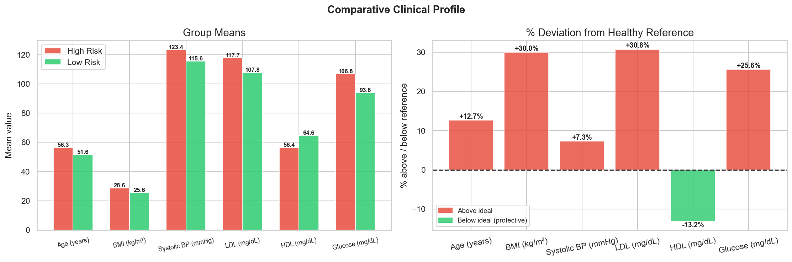
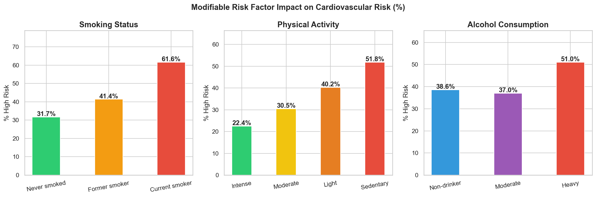

- **Glycaemic markers dominate.** Fasting glucose and HbA1c were the top-ranked variables across all tree-based models, reflecting the strong causal link between insulin resistance and cardiovascular disease.

- **Engineered lipid ratios outperform isolated values.** The LDL/HDL ratio consistently ranked higher than LDL or HDL individually, validating established clinical atherogenic indices.

- **Smoking carries a disproportionate risk premium.** Current smokers show approximately **twice** the high-risk prevalence of non-smokers — the largest single-factor effect in the dataset.

- **Sedentary behaviour is strongly discriminating.** Sedentary patients carry approximately **45 percentage points** higher risk than those with intense physical activity — the most impactful modifiable lifestyle factor after smoking.

- **Diabetes + hypertension = highest-risk group.** Concurrent comorbidities drove roughly double the prevalence of either condition in isolation.

---

## 🚀 How to Run

```bash
# 1 · Clone the repository
git clone https://github.com/semersonantonio/Portfolio.git
cd Portfolio/CardioRisk_ML

# 2 · Install dependencies
pip install numpy pandas matplotlib seaborn scikit-learn xgboost imbalanced-learn

# 3 · Run the notebooks in order
jupyter notebook notebooks/01_data_generation.ipynb
```

> All notebooks are seeded (`random_state = 42`). Run them sequentially — each notebook depends on outputs from the previous one. Notebook 05 is fully self-contained and can be run independently.

---

## 🛠️ Tech Stack

| Tool | Purpose |
|---|---|
| Python 3.10+ | Core language |
| NumPy / Pandas | Data manipulation |
| Matplotlib / Seaborn | Visualisation |
| Scikit-learn | Preprocessing, modelling, evaluation |
| XGBoost | Gradient boosting ensemble (evaluated alongside champion) |
| imbalanced-learn | SMOTE oversampling |
| Jupyter Notebook | Development environment |

---

## 👤 Author

**Emerson Antonio da Silva**
Data Science Student · AI QA Engineer Intern @ ObviousFuture · Madrid, Spain

[](https://linkedin.com/in/emersonantoniods)
[](https://github.com/semersonantonio)
[](https://github.com/semersonantonio/Portfolio)
