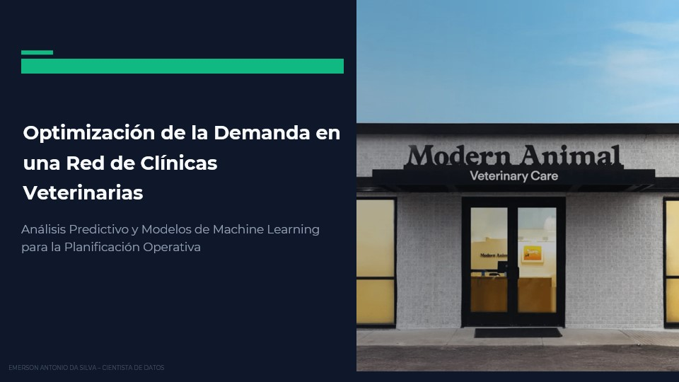
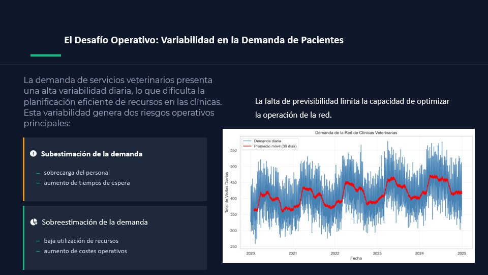
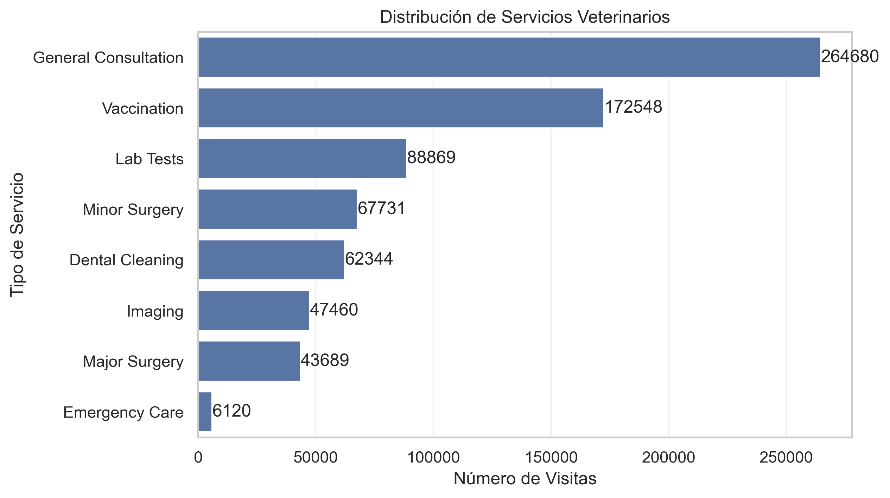
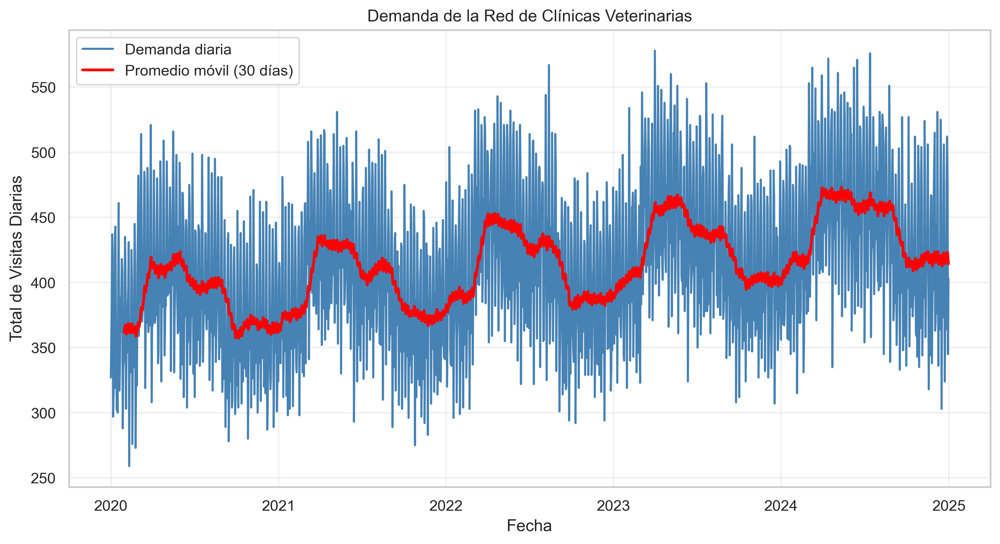
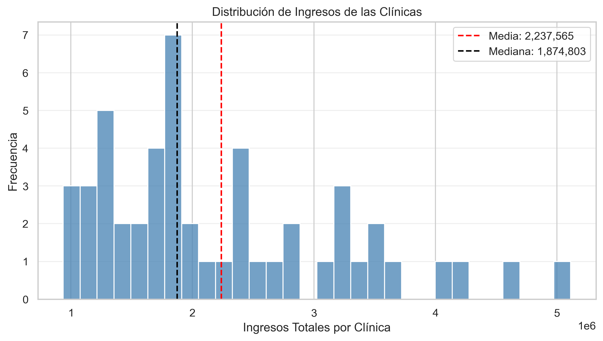
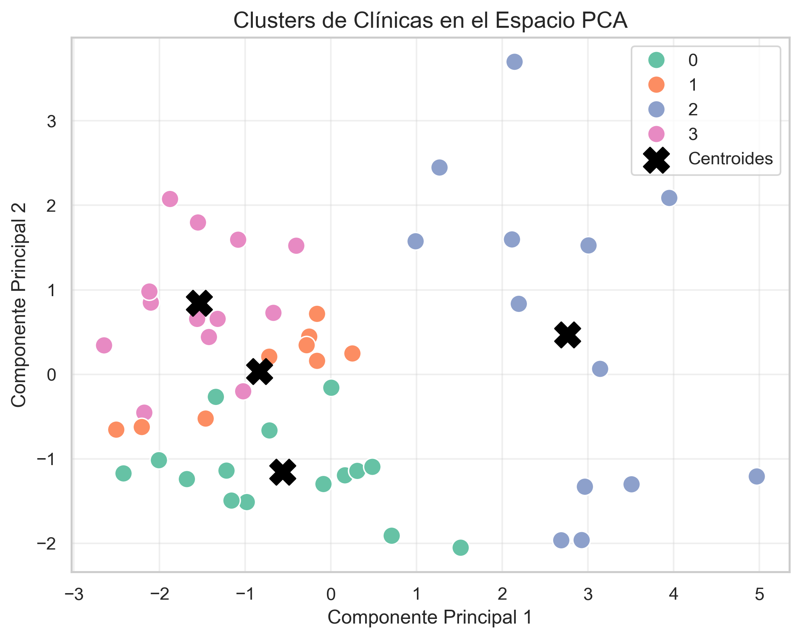
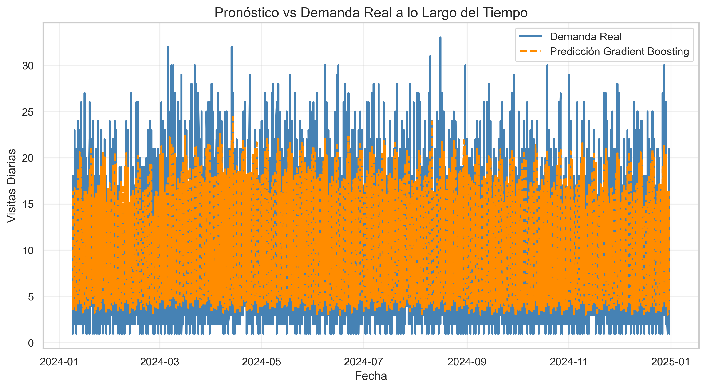
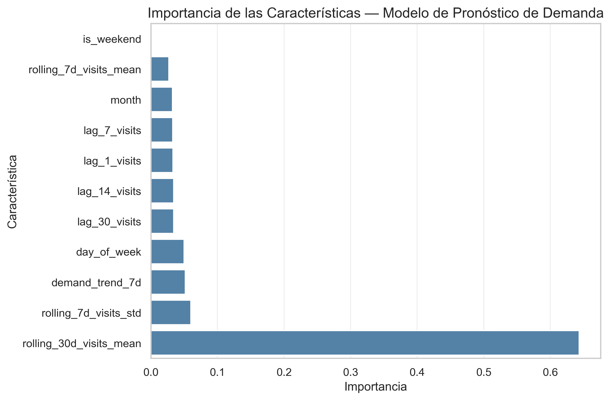
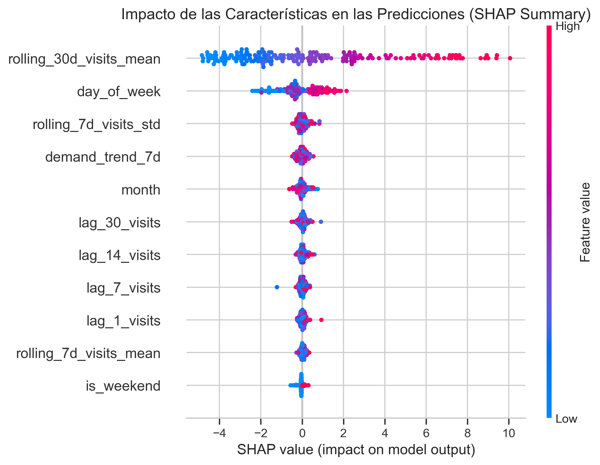

## Previsión de la demanda de la red de clínicas veterinarias

### Presentación

[Ver presentación completa (PDF)](./presentation_mexicans.pdf)

#### Vista previa de la presentación

Las principales diapositivas del proyecto están disponibles como imágenes
para facilitar una rápida visualización:

📁 `figures/07_presentation/`

---

### Introducción

La gestión eficiente de la demanda es uno de los principales desafíos operativos en servicios de salud, incluyendo clínicas veterinarias. La variabilidad en el número de pacientes puede generar ineficiencias como sobrecarga del personal en periodos de alta demanda o infrautilización de recursos en momentos de baja actividad.

Este proyecto desarrolla un flujo completo de Data Science para analizar y predecir la demanda en una **red simulada de clínicas veterinarias**, con el objetivo de mejorar la planificación operativa mediante el uso de datos.

El proyecto incluye:

- generación de datos operativos sintéticos  
- análisis exploratorio de la demanda  
- ingeniería de variables temporales  
- segmentación de clínicas mediante aprendizaje no supervisado  
- modelos de predicción de demanda  
- explicabilidad del modelo mediante SHAP  

---

### Contexto del Problema

Las clínicas veterinarias operan bajo condiciones de demanda variable influenciada por factores como:

- comportamiento de los propietarios de mascotas  
- estacionalidad de tratamientos  
- visitas de emergencia  
- patrones de programación de citas  

Estas fluctuaciones generan desafíos operativos como:

- aumento en los tiempos de espera  
- sobrecarga del personal  
- deterioro en la calidad del servicio  
- infrautilización de recursos  

Los modelos predictivos permiten anticipar la demanda y mejorar decisiones relacionadas con:

- planificación de personal  
- gestión de citas  
- asignación de recursos  
- optimización de la capacidad  

---

### Descripción del Dataset

El análisis se basa en un dataset sintético diseñado para simular una red nacional de clínicas veterinarias.

#### Características principales:

- 50 clínicas  
- 14 ciudades  
- 25,000 mascotas  
- 13,560 clientes  
- 753,441 visitas  
- $111,878,238 ingresos totales  

El dataset incluye información sobre:

- clínicas  
- servicios  
- pacientes (mascotas)  
- visitas  
- métricas operativas diarias  

---

### Estructura de los Datos

| Tabla | Descripción |
|------|-------------|
| cities | Información geográfica |
| clinics | Características de las clínicas |
| services | Servicios veterinarios |
| pets | Información de pacientes |
| visits | Registros de visitas |
| daily_metrics | Métricas agregadas diarias |

---

### Análisis Exploratorio

#### Distribución de Servicios

Los servicios rutinarios, como consultas y vacunaciones, representan la mayor parte de las visitas. Los servicios especializados son menos frecuentes, pero generan mayor ingreso por visita.

---

#### Dinámica de la Demanda

La demanda presenta:

- alta variabilidad  
- persistencia de corto plazo  
- patrones temporales  

Esto justifica el uso de modelos de predicción basados en series temporales.

---

#### Distribución de Ingresos

Existe una fuerte heterogeneidad entre clínicas, lo que indica diferentes perfiles operativos dentro de la red.

---

### Segmentación de Clínicas

Se aplicaron técnicas de:

- StandardScaler  
- PCA  
- KMeans  

La segmentación permite identificar diferentes tipos de clínicas según:

- nivel de demanda  
- generación de ingresos  
- mezcla de servicios  

---

### Modelos de Predicción de Demanda

El problema se formula como una tarea de regresión para predecir el número de visitas diarias.

#### Variables utilizadas:

- variables rezagadas (lags)  
- medias móviles (rolling averages)  
- medidas de variabilidad  
- variables temporales  

### Modelos evaluados:

- Naive baseline  
- Linear Regression  
- Random Forest  
- Gradient Boosting  

---

### Selección del Modelo

El modelo de **Gradient Boosting** fue seleccionado como modelo final debido a su mejor desempeño global.

Resultados aproximados:

- MAE ≈ 2–3 visitas  
- RMSE ≈ 2.9 visitas  
- R² ≈ 0.66  

Estos resultados indican que el modelo captura de forma efectiva los patrones temporales de la demanda.

---

#### Predicción vs Realidad

El modelo logra seguir adecuadamente la tendencia de la demanda, con desviaciones limitadas en periodos de alta variabilidad.

---

### Explicabilidad del Modelo

#### Importancia de Variables

Las variables más relevantes están asociadas a:

- demanda reciente  
- medias móviles  
- patrones temporales  

---

#### Análisis SHAP

El análisis muestra que:

- la demanda reciente es el principal predictor  
- existen patrones semanales claros  
- la demanda presenta fuerte dependencia temporal  

---

#### Aplicaciones Operativas

Las predicciones permiten:

- planificar turnos de personal  
- optimizar agendas  
- mejorar la asignación de recursos  
- anticipar picos de demanda  

Por ejemplo, si un veterinario atiende aproximadamente 24 consultas diarias, el modelo permite estimar el número necesario de profesionales por día.

---

#### Tecnologías

- Python  
- Pandas  
- NumPy  
- Scikit-learn  
- Matplotlib  
- Seaborn  
- SHAP  
- Jupyter Notebook  

---

#### Autor

Emerson Antonio da Silva
